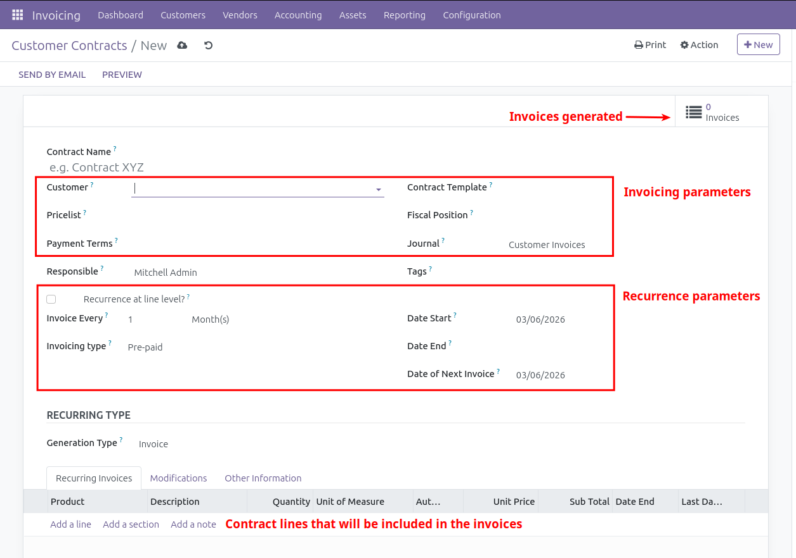
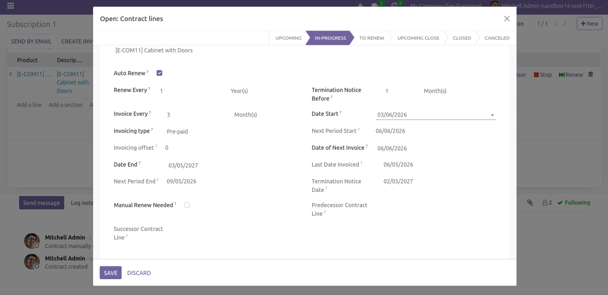
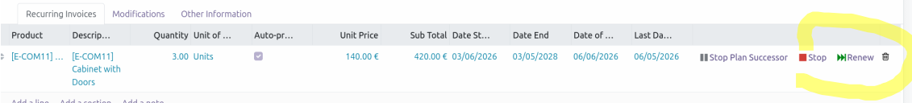
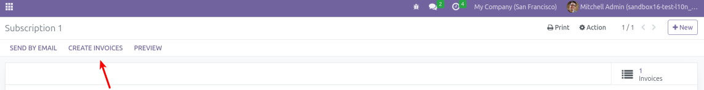
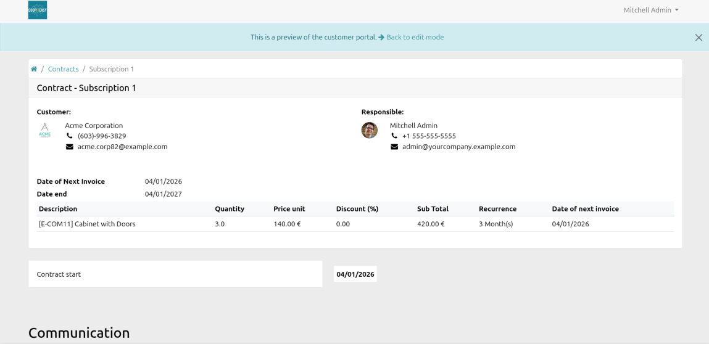

Contracts are available in *Invoicing > Customers > Customer Contracts* and *Invoicing > Vendors > Supplier Contracts*.

Click on **New** to create a new contact. Here is an overview:

## Invoicing parameters : 
- the partner (customer or supplier depending on the type of contract)
- the **Journal** is filled with the default customer/supplier journal (first in sequence in *Configuration > Journals*)
- **Pricelist**, **Payment terms** and **Fiscal position** are filled in from the partner information, if available

## Recurrence parameters : 
- **Invoice every** : Invoicing interval, in terms of days, weeks, months, months last day, semesters or years 
- **Start Date** of the contract, from which the invoicing period will start
- **End Date** of the contract is optional. If not filled the invoice generation will never stop. 
- The **Date of Next Invoice** is automatically computed, but can be can be modified manually 
- **Invoicing type** : pre-paid or post-paid. A pre-paid contract generates the invoice at the beginning of the invoicing period, a post paid contract generates it at the end. 
- **Generation Type** has only one option "Invoice". Other options are added in separate modules. 
- **Recurrence at lines level** : see below

## Contract lines
These lines will be used to generate the invoice lines. You can fill in the product with a description, a quantity and a price. 

The **Description** can include the markers `#START#`, `#END#` and `#INVOICEMONTHNAME#` in the description field. This will display the start/end date or the start month of the invoiced period in the invoice line description. 

Check **Auto-price** for having the price automatically obtained and updated from the price list. 

## Reccurence at lines level
**Recurrence at lines level** is a different "mode", where each contract line has it's own recurrence properties. For instance, one line starts on 02/02/2026 and is invoiced every 2 weeks, and another line starts on 04/04/2026 and is invoiced yearly. 

However, this mode and offers more reccurrence features, besides those already presented.

Contract lines are now opened in a form view.

**Auto-renew** : contract lines will be automatically renewed when the **End Date** is reached. The End Date will be postponed by the duration set in the **Renew Every** field. 

The field **Termination Notice before** will set the duration before the **End Date** when the contract line state will change from *In Progress* to *Upocoming close*. By default, the state changes one month before the **End Date**. 

Lines can also be manually renewed in advance using the green **Renew** button.

You can **Stop** a contract line using the red button at the right. 

A pop up will open asking for an **Stop Date**. In a pre-paid contract, this date must be after the end of the period already invoiced. For instance, if the last invoice covers the period from 01/01/2026 to 31/01/2026, the stop date must be equal or after 31/01/2026. 

You can also **Stop and plan a successor**. A popup will ask for a new Start and End date. The contract line will be stopped and a new one will be created with the given Start and End dates. 

## Invoice generation
The **Generate Recurring Invoices from Contracts** cron, available in Settings > Technical > Automation > Scheduled Action, runs daily to generate the invoices. Execution time and frequency can be configured in the cron settings. 

If you are in [debug mode](https://www.odoo.com/documentation/16.0/fr/applications/general/developer_mode.html), you can click on the **Create Invoices** button.

## Reporting

The **Show recurring invoices** shortcut on contracts shows all invoices created from the contract.

The menu *Invoicing > Reporting > Contracts > Customer Contract Lines/Supplier Contract Lines* allows to view all contract lines in a list view. Lines can be edited from there. 
Note : pivot view is not available in this report.

## Printing, sending by email and portal access

The contract pdf report can be printed from the **Print** menu.

The contract can be sent by email with the **Send by Email** button

Contracts appear in portal to following users:

