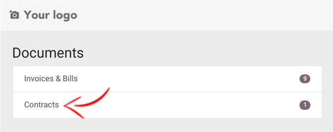
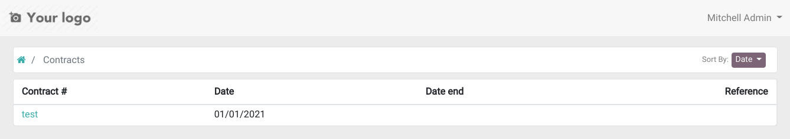
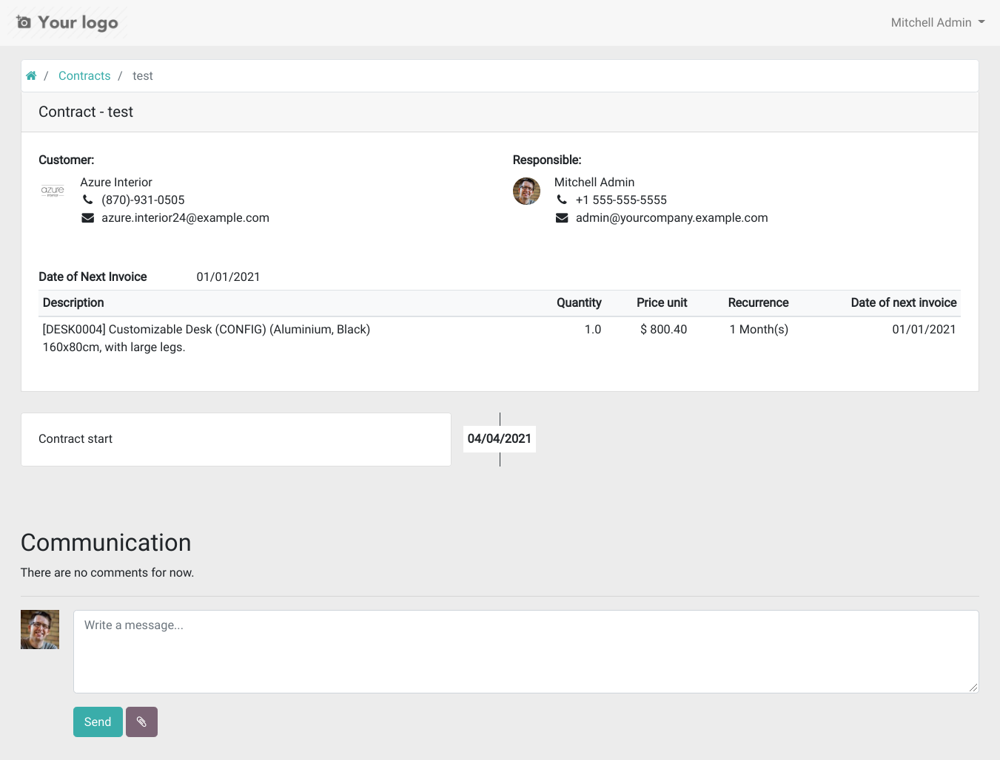

#. Contracts are in Invoicing -> Customers -> Customer and Invoicing -> Vendors -> Supplier Contracts
#. When creating a contract, fill fields for selecting the invoicing parameters:

   * a journal
   * a price list (optional)

#. And add the lines to be invoiced with:

   * the product with a description, a quantity and a price
   * the recurrence parameters: interval (days, weeks, months, months last day or years),
     start date, date of next invoice (automatically computed, can be modified) and end date (optional)
   * auto-price, for having a price automatically obtained from the price list
   * #START# or #END# in the description field to display the start/end date of
     the invoiced period in the invoice line description
   * pre-paid (invoice at period start) or post-paid (invoice at start of next period)

#. The "Generate Recurring Invoices from Contracts" cron runs daily to generate the invoices.
   If you are in debug mode, you can click on the invoice creation button.
#. The *Show recurring invoices* shortcut on contracts shows all invoices created from the
   contract.
#. The contract report can be printed from the Print menu
#. The contract can be sent by email with the *Send by Email* button
#. Contract templates can be created from the Configuration -> Contracts -> Contract Templates menu.
   They allow to define default journal, price list and lines when creating a contract.
   To use it, just select the template on the contract and fields will be filled automatically.

* Contracts appear in portal to following users in every contract:

