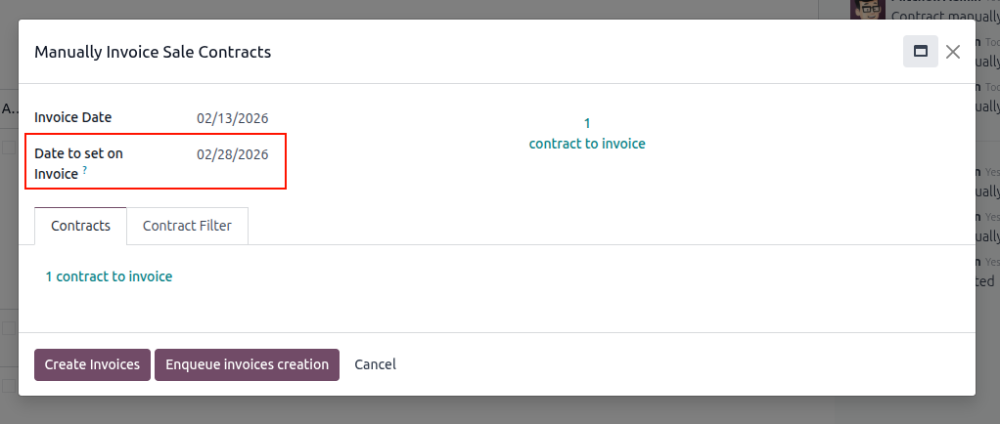
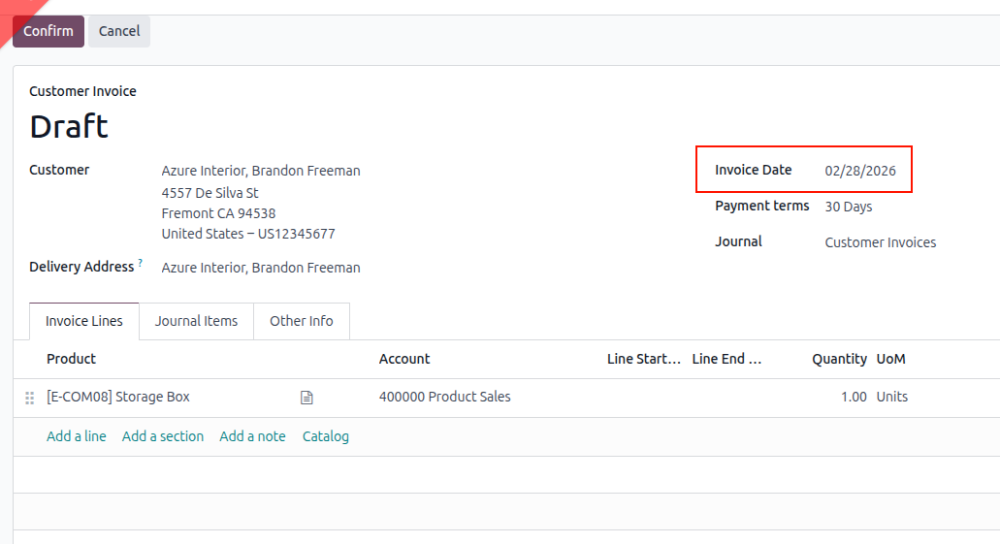

To use this module, you need to:

1. Go to *Accounting* > Customers/Vendors > Manually invoice contracts
1. In the popup, choose invoicing date to select contracts to invoice
1. If contracts are available to invoice, you can set **Date to set on Invoice**

1. **Create Invoices**
1. The invoices are generated with the date chosen

