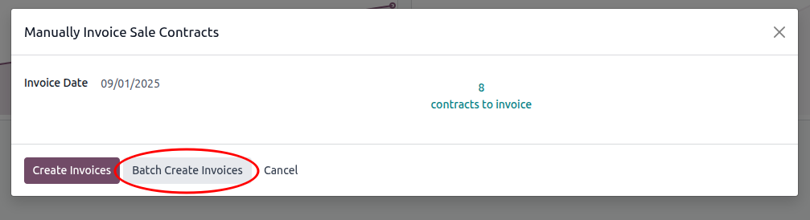

Automated invoices are created in batch automatically.

For manually creating invoices in batch, go to:
1. Go to *Invoicing* or *Accounting* >
  - Customers > **Manually Invoice Sale Contracts** or
  - Vendors > **Manually Invoice Purchase Contracts**
2. Choose **Batch Create Invoices**
  

See them in Job Queue > Jobs:
-  *Automated/Manual Batch Invoice Contracts*
