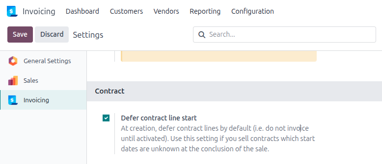
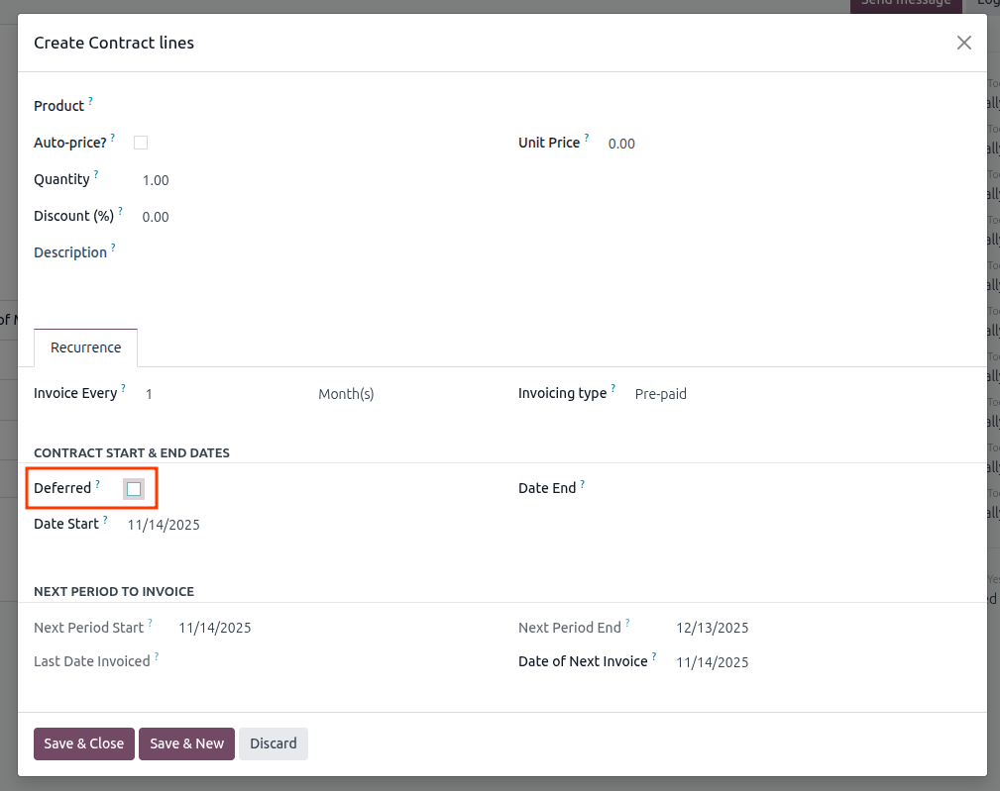
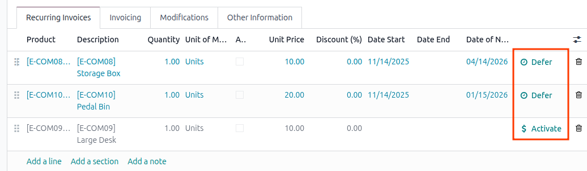

Optional Settings
-----------------

1. Go to *Invoicing/Accounting* > Configuration > Settings > Contract
1. Select **Defer contract line start** if you want to defer contract lines by default. Use this setting if you sell contracts which start dates are unknown at the conclusion of the sale.

Add a contract line
-------------------

When adding a contract line, you can select **Deferred** instead of a start date

Modify a contract line
----------------------

An existing contract line can be deferred and activated via a button on the line

Activate a contract line
------------------------

When activating a line, a new start (and optionally end) date can be chosen.

