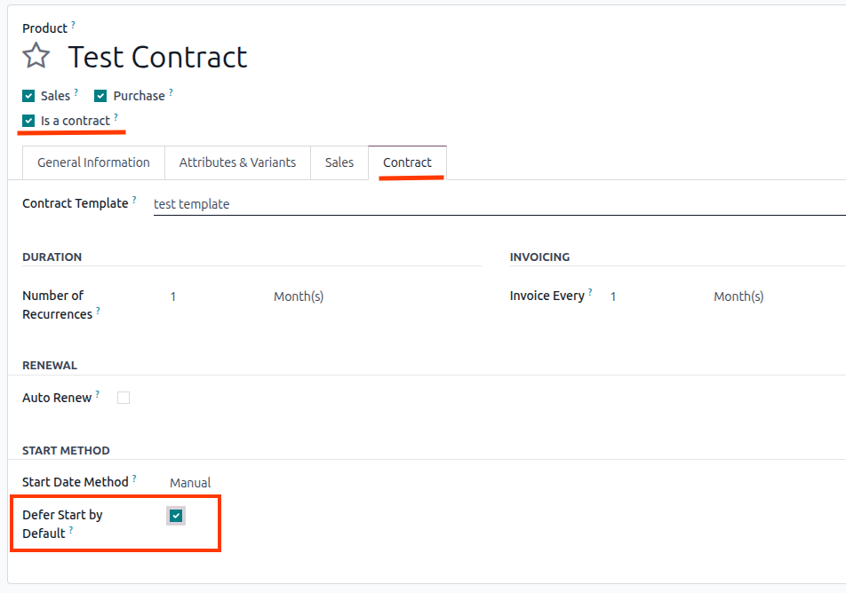
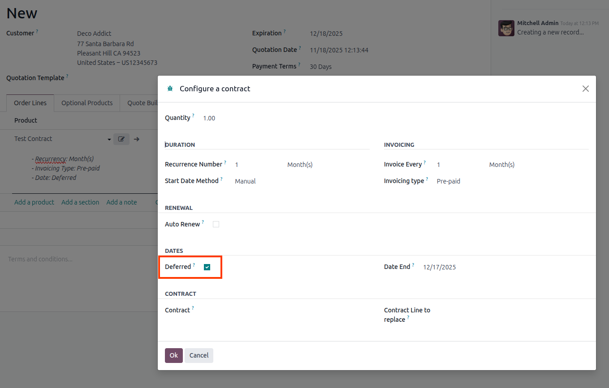

Optional Settings
-----------------

1. Go to *Sales* > Products > Products
1. On a Contract Product, go to tab Contract > Start Method > Defer Start by Default

Add a contract product to a Sale Order
--------------------------------------

When adding a product, choose to defer its start date.

